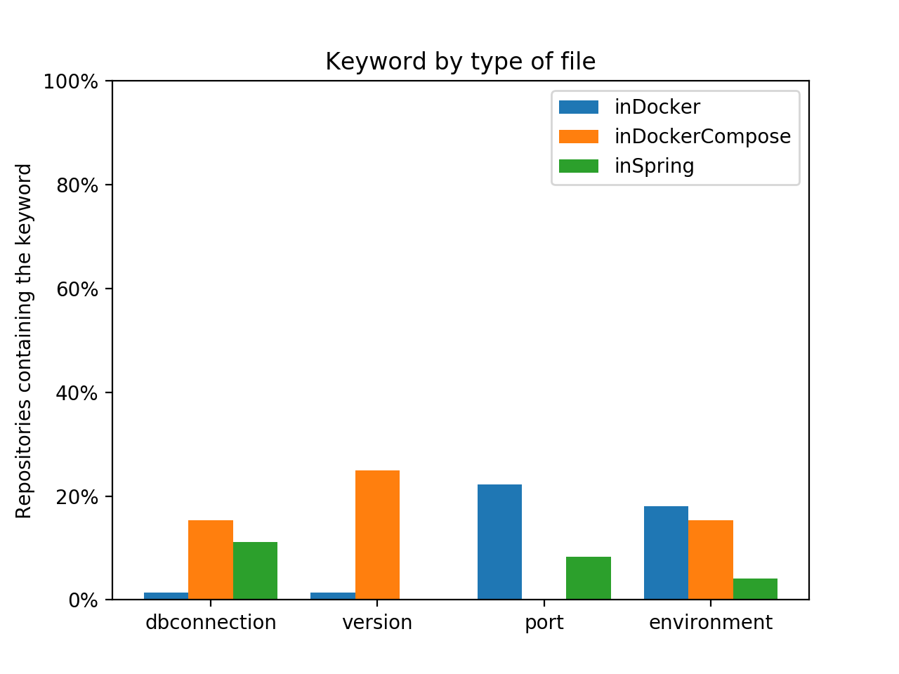
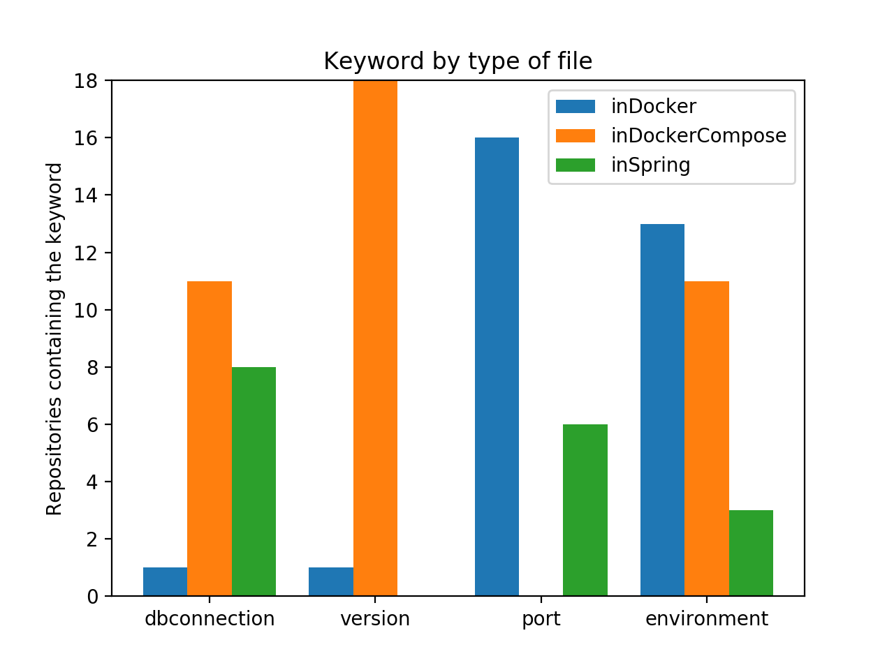

---

> **Date de rendu finale : Mars 2020 au plus tard**
> - Respecter la structure pour que les chapitres soient bien indépendants
> - Remarques :
>>    - Les titres peuvent changer pour etre en adéquation avec votre étude.
>>    - De même il est possible de modifier la structure, celle qui est proposée ici est là pour vous aider.
>>    - Utiliser des références pour justifier votre argumentaire, vos choix etc.

---

**_janvier 2020_**


## Authors

Nous somme quatre étudiants en dernière année d'architecture logicielle à Polytech Nice-Sophia : 

* BENAZET-LACARRE Laurent-Jérôme&lt;laurent-jerome.benazet-lacarre@etu.univ-cotedazur.fr&gt;
* FRERE Baptiste &lt;baptiste.frere@etu.univ-cotedazur.fr&gt;
* MENARD Noé &lt;noe.menard@etu.univ-cotedazur.fr&gt;
* SALORD Florian &lt;florian.salord@etu.univ-cotedazur.fr&gt;

## I. Research context /Project

Docker est un logiciel libre permettant de lancer des applications dans des conteneurs logiciels [[1]](https://fr.wikipedia.org/wiki/Docker_(logiciel)).  
C'est un logiciel récent, sa première version open source datant de mars 2013.  
En l'espace de quelques années, il s'est imposé comme un standard de l'industrie. Son succès provient de plusieurs aspects tels que : 

* Une véritable alternative aux machines virtuelles traditionnelles dans le cadre d'un déploiement d'application
* Une grande portabilité pour les applications, qui les rend agnostique du système d'exploitation de la machine hôte.
* Des capacités de configuration pour l'utilisateur.
* Une isolation des processus.


Nous avons choisi de nous pencher sur l'étude de Docker pour plusieurs raisons : 

D'une part, c'est une question qui nous parle. 
Nous avons déjà réalisé des projets d'architecture logicielle où la question d'avoir une solution configurable est apparue, que cela soit pour séparer un environnement de développement et de production, ou pour livrer un produit qui soit adapté aux attentes d'un client.  

D'autre part, c'est un sujet d'actualité. De plus en plus d'applications sont conteneurisées afin d'être déployée dans des solutions *cloud* ou des *clusters* d'orchestrateurs de conteneurs. Ces applications ont besoins d'être configurées à différents niveaux en fonction du type de paramètre. 


{:height="50px" }


## II. Observations/General question

Dans ce projet nous nous focaliserons sur la question suivante :  
**Comment les paramètres de haut niveau agissent sur des logiciels conteneurisés ?**

C'est une question très vaste. 
En analysant différents projets utilisant Docker, on se rend compte que les mêmes paramètres peuvent être définis à différents niveaux.  
La même variable peut être définie au niveau d'un fichier `Dockerfile` [[2]](https://docs.docker.com/engine/reference/builder/), d'un fichier `docker-compose.yml` [[3]](https://docs.docker.com/compose/) ou dans une des fichiers de configuration spécifique au langage ou *framework* utilisé par l'application.  
On est alors amené à se demander : À quels niveaux peut-on définir théoriquement chaque paramètre et plus concrètement, à quels niveaux sont-ils réellement définis ?  

Cette question reste encore très vaste, on ne peut pas analyser tous les paramètres qui existent.  
Pour réaliser notre étude, nous avons ainsi décidé de nous focaliser sur des paramètres fréquemment utilisés dans des applications.  

* Les URLs de base de données
* La gestion des versions
* Le port exposé par un serveur
* Les environnements (production, développement, test)

Nous avons aussi décidé de restreindre notre analyse aux projets utilisant Docker et le *framework* Spring [[4]](https://spring.io).  
Nous avons choisi ce *framework* au vu de nos connaissance préalables et du fait que l'ensemble de la configuration se fait dans un fichier `application.properties`.  
Ce fichier unique permet une automatisation de nos analyses.

## III. information gathering

Nous avons dans un premier temps effectué des recherches afin de savoir où et comment les différents paramètres qui nous intéressent peuvent être définis. 

L'objectif de l'étude étant de comparer ces postulats avec les informations recueillies suite à l'analyse d'un ensemble de dépôts Git, nous avons tout d'abord sélectionné un échantillon de projets sur GitHub afin de réaliser nos premières analyses.  
Ces projets devaient contenir à la fois le tag 'Docker' et le tag 'Spring' afin d'être sélectionnés et ont été retenus de par leur nombre important d'étoiles Docker (signe de popularité).  
Une étape de pre-processing était ensuite effectué afin de s'assurer que les projets retenus comportaient bien au moins un `Dockerfile` ou un `docker-compose.yml` et un fichier de configuration Spring.  
Tout ce processus de selection du dataset a été automatisé grâce à un script Python utilisant les *packages* PyGitHub pour la sélection des dépôts et PyGit2 pour leur clonage.

Une fois le dataset constitué, une phase d'analyse pour chacun des projets à lieu.  
Dans un premier temps, il faut déterminer si un paramètre a été utilisé, et si c'est le cas à quel niveau ce dernier a été défini. 

parler exactement de comment on fait avec mots associés à un tag, dire les limites : qu'on peut avoir oublier / mal defini des params, qu'il aurait été intéressant pour aller plus loin de faire de l'analyse dynamque en linkant le code aux paramètres mais ce que c'est beaucoups plus compliqué à faire. 

ARTICLES @laurent

Préciser vos zones de recherches en fonction de votre projet,

1. les articles ou documents utiles à votre projet
2. les outils
 
## IV. Hypothesis & Experiences

Nous partions de l'hypothèse que certains paramètres étaient plus utilisés à certains niveaux (mettre tableau de nos hypothèse ...).  L'object était ainsi de voir si nos hypothèses étaient correct ou pas.
Nous avons obtenues les résultats suivants : 

1. Il s'agit ici d'énoncer sous forme d' hypothèses ce que vous allez chercher à démontrer. Vous devez définir vos hypothèses de façon à pouvoir les _mesurer facilement._ Bien sûr, votre hypothèse devrait être construite de manière à v_ous aider à répondre à votre question initiale_.Explicitez ces différents points.
2. Test de l'hypothèse par l'expérimentation. 1. Vos tests d'expérimentations permettent de vérifier si vos hypothèses sont vraies ou fausses. 2. Il est possible que vous deviez répéter vos expérimentations pour vous assurer que les premiers résultats ne sont pas seulement un accident.
3. Explicitez bien les outils utilisés et comment.
4. Justifiez vos choix

## V. Result Analysis and Conclusion

1. Analyse des résultats & construction d'une conclusion : Une fois votre expérience terminée, vous récupérez vos mesures et vous les analysez pour voir si votre hypothèse tient la route. 


Après analyse de 72 dépôts GitHub ayant pour `topic` Docker et Spring, nous avons obtenu les résultats suivants :

<center>


*Figure 1 : Parameter presence according to file repartition in percentage*


*Figure 2 : Parameter presence according to file repartition in values*

</center>

On observe pour chacun des paramètres une répartition bien différentes au niveau de leur localisation.  

### Connexion à une base de données

Pour la connexion à une base de données, la présence de l'url majoritairement dans le `docker-compose` correspond aux hypothèses que nous avions posé vis-à-vis du fait que les URLs de ressources soient principalement dans les niveaux les plus élevés, à savoir à l'exécution des conteneurs Docker. On constate néanmoins une forte prévalence de ces paramètres dans les fichiers de configuration Spring, ce qui peut être du à la simplicité d'utiliser différents fichiers de configuration en fonction de l'environnement utilisé.

### Version
Les versions sont en grande majorité déclarées dans les fichiers `docker-compose`. Ce résultat peut être du à une erreur dans les mots clés choisis pour représenter les versions.  
APPROFONDIR

### Port

Les résultats sur les ports nous paraissent étonnant. En effet il fréquent dans notre usage de Compose d'exposer les ports des serveurs via le mot-clé `ports`, qui n'a ici retrouvé dans aucun des projets analysés.  
On constate une prévalence de déclaration de port au niveau du `Dockerfile` plutôt que dans les configurations Spring.  
Une explication possible de ce déséquilibre peut venir de l'utilisation du port par défaut des projets Spring, qui peut suffire dans le cas dans serveur conteneurisé.

### Environnement

Avec les connexions aux bases de données, la gestion d'environnements est la seule à être présente sur tous les niveaux de déclaration possibles.  
En majorité présents dans le Dockerfile, qui permet de définir du comportement de manière statique, il permet notamment d'avoir de multiples images avec des configurations différentes prêtes à l'emploi. Leur utilisation dans les `docker-compose` est assez proche, ce qui permet de n'avoir qu'une seule image du projet et de pouvoir changer d'environnement *on the fly*. Cette utilisation nécessite cependant d'embarquer l'intégralité des dépendances des différentes configurations dans l'image Docker.  
Enfin l'utilisation des variables d'environnement au niveau de Spring peut être du à une prévalence de l'utilisation des profils Maven, souvent associé aux projets Spring.


## VI. Tools
Ce projet utilise plusieurs scripts Python afin de mener à bien ses analyses :

- crawler : permet de sélectionner et cloner les dépôts GitHub d'intérêt, c'est-à-dire ayant les tags 'Docker' et 'Spring'. Ils sont clonés par ordre décroissant d'étoiles.

	```
	export TOKEN=github token
	python3 crawler.py
	```
- analyzer : permet de parcourir l'ensemble des dépôts clonés et d'en extraire les données souhaitées, à savoir la quantité et le type de paramètres trouvés en fonction du niveau de définition. Génère un fichier au format xlsx (Excel) avec ces données.

	```
	python3 analyzer.py
	```
- graphs et filereader : permettent de générer des graphes à partir des données du fichier xlsx généré par analyzer.
	```
	python3 filereader.py data.xlsx
	```


## VI. References
@laurent